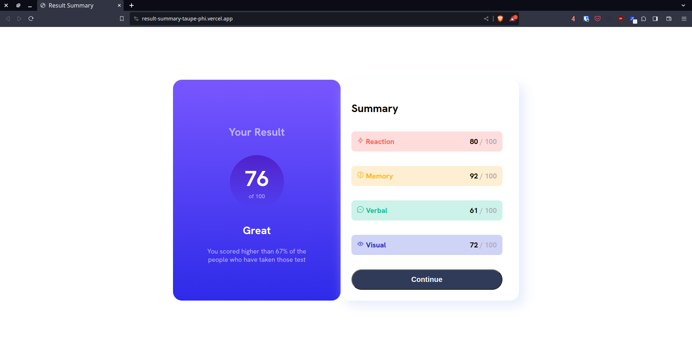
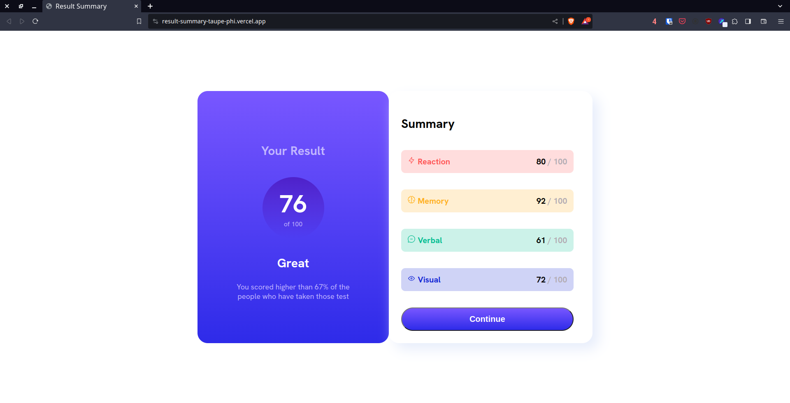

# Frontend Mentor - Results summary component solution

This is a solution to the [Results summary component challenge on Frontend Mentor](https://www.frontendmentor.io/challenges/results-summary-component-CE_K6s0maV). Frontend Mentor challenges help you improve your coding skills by building realistic projects. 

## Table of contents

- [Overview](#overview)
  - [The challenge](#the-challenge)
  - [Screenshot](#screenshot)
  - [Links](#links)
- [My process](#my-process)
  - [Built with](#built-with)
  - [What I learned](#what-i-learned)
  - [Continued development](#continued-development)
  - [Useful resources](#useful-resources)
- [Author](#author)
- [Acknowledgments](#acknowledgments)

**Note: Delete this note and update the table of contents based on what sections you keep.**

## Overview

### The challenge

Users should be able to:

- View the optimal layout for the interface depending on their device's screen size
- See hover and focus states for all interactive elements on the page
- **Bonus**: Use the local JSON data to dynamically populate the content

### Screenshot





### Links

- Solution URL: [https://github.com/cocotiwak/result-summary](https://github.com/cocotiwak/result-summary)
- Live Site URL: [https://result-summary-taupe-phi.vercel.app/](https://result-summary-taupe-phi.vercel.app/)

## My process

### Built with

- Semantic HTML5 markup
- CSS custom properties
- Flexbox
- Javascript


### What I learned


```html
<div class="stats">
   <div class="reaction">
        <p class="item"> Reaction</p><p class="score">80 <span class="score-max">/ 100</span></p>
   </div>
</div>
```
```css
.circle{
    width: 150px;
    height: 150px;
    border-radius: 50%;

:root{
    --Light-red: hsl(0, 100%, 67%);
    --Orangey-yellow: hsl(39, 100%, 56%);
    --Green-teal: hsl(166, 100%, 37%);
    --Cobalt-blue: hsl(234, 85%, 45%);
    --Light-slate-blue: hsl(252, 100%, 67%);
    --Light-royal-blue: hsl(241, 81%, 54%);
    --Violet-blue: hsla(256, 72%, 46%, 1);
    --Persian-blue: hsla(241, 72%, 46%, 0);
    --White: hsl(0, 0%, 100%);
    --Pale-blue: hsl(221, 100%, 96%);
    --Light-lavender: hsl(241, 100%, 89%);
    --Dark-gray-blue: hsl(224, 30%, 27%);

```
```JS
fetch('data.json') // Replace 'your-json-file.json' with the correct path to your JSON file
      .then(response => response.json())
      .then(data => {
        // Iterate through each data entry and display it in the corresponding container
        data.forEach((entry, index) => {
          const containerId = `data-container${index + 1}`;
          const container = document.getElementById(containerId);

          if (container) {
            // Create a div element for each data entry
            const divElement = document.createElement('div');
            divElement.className = 'inner';

            divElement.innerHTML = `
                    
                        <p class="item"> ${entry.category}</p><p class="score">${entry.score} <span class="score-max">/ 100</span></p>
                    
            `;

            // Append the div element to the container
            container.appendChild(divElement);
          }
        });
      })
      .catch(error => console.error('Error fetching JSON:', error));
```


### Continued development

- learn Javascript for reading JSON file and update html code. **Update : already using JS for JSON fetch.


### Useful resources


## Author

- Website - [Add your name here](https://www.your-site.com)
- Frontend Mentor - [@yourusername](https://www.frontendmentor.io/profile/yourusername)
- Twitter - [@kenyaldanbulat](https://twitter.com/kenyaldanbulat)


## Acknowledgments

Me, Myself, and ChatGPT
